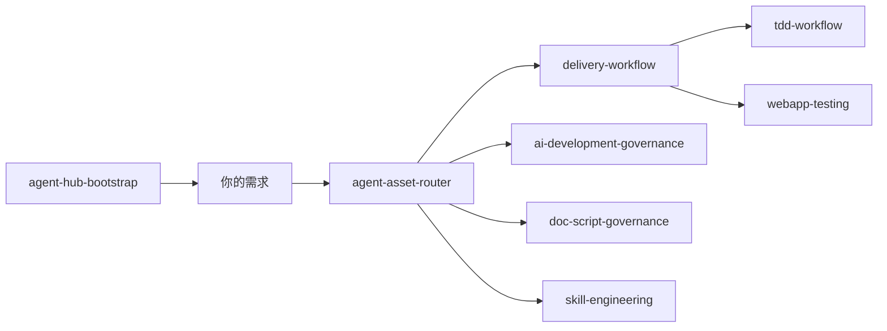

# 技能说明与整体用法

> **语言**：[简体中文](SKILLS_GUIDE.md) | [English](SKILLS_GUIDE.en.md)

本页说明 **agent-hub-share** 中 13 个共享技能各自做什么、何时该用，以及从克隆到日常协作的最短路径。Agent 运行时入口始终是各技能目录下的 `SKILL.md`；本页供**人类**选型与 onboarding。

## 整体怎么用

```text
克隆本仓 → 设置 AGENTS_HUB_ROOT → install-hub（挂载技能 + 同步全局规则）
    → 可选 register-project（项目 overlay）
    → 在 IDE 里用自然语言提需求 → Agent 按技能路由执行
    → 改仓内技能/文档前跑门禁脚本（见 VERIFY）
```

### 四步上手

1. **克隆并设根目录**  
   `git clone git@github.com:yxkong/agent-hub-share.git agent-hub`，将 `AGENTS_HUB_ROOT` 指向该目录（详见 [QUICKSTART.md](QUICKSTART.md)）。

2. **安装到客户端**  
   运行 `scripts/install-hub`（先 `--dry-run` 预演）。会把 `skills/share/*` 链到 Cursor / Claude / Codex 的用户技能目录，并同步 `rules/common/COMMON_AGENT_RULES.md`。

3. **（可选）注册业务项目**  
   在业务仓库根目录执行 `register-project`，生成 `PROJECT_RULES.md` / `AGENTS.md` 等 overlay，让 Agent 知道项目增量规则（Prompt 在 private hub 维护，本仓不含 `prompts/`）。

4. **日常协作**  
   - 有研发任务 → 先说清目标，Agent 应走 `delivery-workflow`（阶段门、Fast/Full Path）。  
   - 不确定该用哪个技能 → 先说产物类型（写代码 / 写文档 / 做 skill / 做测试…），由 `agent-asset-router` 分流。  
   - 改 `docs/`、SQL、技能主文件前 → `doc-script-governance` 要求先 `backup-file`。

### 套餐怎么选

| 套餐 | 技能 | 适合谁 |
|------|------|--------|
| **Minimal** | bootstrap + delivery + doc-script | 只想降返工、规范文档与交付节奏 |
| **Standard** | Minimal + governance + router + scorecard + biz-safety | 要 Spec/门禁/评分/业务安全审计 |
| **Asset Factory** | Standard + skill/prompt 工程 + discovery | 维护 Agent 资产的人 |
| **Full** | Asset Factory + insight + TDD + webapp-testing | 全链路：洞察沉淀 + 测试 + 浏览器验证 |

更细的安装与烟测见 [VERIFY.md](VERIFY.md)。

---

## 13 个技能一览

| 技能 | 一句话 | 路径 |
|------|--------|------|
| agent-asset-router | 混合任务先判产物，再转交对口技能 | `skills/share/agent-asset-router/` |
| agent-hub-bootstrap | 装 hub、修链接、发 skill、查挂载 | `skills/share/agent-hub-bootstrap/` |
| ai-development-governance | Spec/ADR/门禁/评分总线（不写业务代码） | `skills/share/ai-development-governance/` |
| biz-safety-audit | UGC/交互/短信等业务侧安全审计 | `skills/share/biz-safety-audit/` |
| delivery-workflow | 研发交付阶段门（默认必触） | `skills/share/delivery-workflow/` |
| doc-script-governance | 文档/SQL 放哪、改前备份 | `skills/share/doc-script-governance/` |
| project-insight-extractor | 从调试/复盘提炼给人读的洞察 | `skills/share/project-insight-extractor/` |
| prompt-engineering | 长 prompt / agent-task 资产化 | `skills/share/prompt-engineering/` |
| skill-discovery | 找 skill、装 skill、该不该做成 skill | `skills/share/skill-discovery/` |
| skill-engineering | 写/改/审 SKILL.md 与 references | `skills/share/skill-engineering/` |
| skill-scorecard | skill/prompt 双百分评分与门禁 | `skills/share/skill-scorecard/` |
| tdd-workflow | 先红后绿再重构的 TDD 节奏 | `skills/share/tdd-workflow/` |
| webapp-testing | 本地 Web 黑盒/冒烟/浏览器自动化 | `skills/share/webapp-testing/` |

---

## 各技能介绍与作用

### 1. `agent-asset-router` — 资产任务总路由

**介绍**：当一句话里混着「写 skill、改文档、做 Spec、跑测试」等多种意图时，先判断**最终产物**是什么，再转到对应技能，避免 Agent 猜错入口。

**作用**：统一分流到 discovery / engineering / doc-script / governance / delivery / TDD / webapp-testing 等；不代替具体实现。

**何时用**：任务类型不清、或用户同时提了多类交付物。

**示例**：「我要整理一套 Agent 规范，顺便把文档备份流程也定下来」→ 应先路由，再分别打开 doc-script 与 skill-engineering。

---

### 2. `agent-hub-bootstrap` — Hub 安装与挂载

**介绍**：把本仓（或 fork）挂到 Cursor / Claude / Codex，修复断链，发布 skill 到用户目录。

**作用**：`install-hub`、`register-project`、`check-skill-links`、`publish-skill` 等操作的 SOP；解决「客户端找不到技能」。

**何时用**：首次安装、换机、链接损坏、多仓 junction 冲突。

**示例**：「Cursor 里看不到 agent-hub 的技能」→ bootstrap + `check-skill-links`。

---

### 3. `ai-development-governance` — AI 研发治理总线

**介绍**：从需求到发布的**治理语言**：Feature Spec、ADR、任务契约、G0–G8 阶段门、质量/安全/发布/回滚/可观测门禁、9.8 评分卡。

**作用**：定「要做到什么程度才能合并/上线」；与 `delivery-workflow` 分工——治理定标准，delivery 定节奏。Full Path 可叠加 `context_persistence_gate.md`（过程区归档与反迎合）；跨项目契约见 `references/gates/project_contract_gate.md`。

**何时用**：新功能要 Spec、架构要 ADR、上线前要门禁清单、要做发布前评分、跨仓/共享 DB·API 要对齐契约。

**示例**：「这个需求写一份 Feature Spec 和任务契约」→ governance 模板 + delivery 执行。

---

### 4. `biz-safety-audit` — 业务安全审计

**介绍**：审计**业务层**安全：内容发布、用户交互、短信/通知频率、防刷、敏感词等（不是 IAM/租户那种基础设施安全门禁）。

**作用**：按 checklist 查盲区；与 governance 的 Security Gate 互补。

**何时用**：UGC、评论、验证码、短信轰炸、运营配置类需求评审。

**示例**：「用户一天能发几条短信验证码，规则齐不齐？」→ biz-safety-audit。

---

### 5. `delivery-workflow` — 研发交付工作流

**介绍**：**几乎所有研发任务**的默认入口：需求理解 → 设计收敛 → 最小实现 → 验证收口 → **复盘落盘** → 失败沉淀；含 Fast/Full Path、前后端/SQL 子路由、调试三联检、**主链证据矩阵**（Gate 4）、**hub replay 复盘**（Gate 5）、**R3 handoff**（Gate 6）。

**作用**：控制 Agent 别跳步、别用「规则写了」冒充「任务完成」；Full Path 必须区分 static/contract/runtime/user-visible/release/limitation 证据；返工按 R3 路由到 insight / 反模式 / prompt。

**何时用**：新功能、修 Bug、重构、联调、数据迁移、接口「成功但没数据」；用户说「研发体系审计 / 证据闭环 / release evidence / Task Replay」时走 **`rd-audit`** 路由（见 `references/gates/ai_rd_closure_audit.md`）。

**示例**：「这个需求先做什么后做什么？」→ delivery-workflow；「帮我审计这套 AI 研发体系是否真闭环？」→ `rd-audit`。

---

### 6. `doc-script-governance` — 文档与 SQL 治理

**介绍**：规定 `docs/`、dev/online SQL、技能资料的**目录、命名、模板、改前备份**；含 G0 头脑风暴收敛模板（`TEMPLATE_BRAINSTORM_CONVERGENCE.md`）。

**作用**：`backup-file`、文档类型 ID、设计文档终版落点；与 delivery / governance 的设计整合门、AGENT-GATE-CARD G4 备份门衔接。

**何时用**：review 文档放哪、合并 plan 进 design、改 SKILL/README 前备份、SQL 分层、方案讨论要先输出 fact/assumption/risk 再收敛。

**示例**：「这个技能 README 改前要怎么备份？」→ doc-script-governance。

---

### 7. `project-insight-extractor` — 技术洞察提炼

**介绍**：从会话、调试记录、重构说明、diff 中抽出**给人读**的案例、方法论、简历 bullet（不是给 Agent 跑的长 prompt）。

**作用**：复盘、面试、知识库归档；输出模板与去重规则。

**何时用**：迭代结束要写复盘、要把调试过程变成可分享洞察。

**示例**：「把这次排查接口缺数据的过程整理成一篇案例」→ insight extractor。

---

### 8. `prompt-engineering` — 提示词资产工程

**介绍**：子 Agent 长指令、系统提示词、eval 的**裁剪、分层、落盘**（`prompts/share` vs `prompts/projects` 在 private hub）。

**作用**：把一次性聊天 prompt 变成可版本化的 prompt 资产；不负责 SKILL.md 正文。

**何时用**：要沉淀 agent-task、优化触发稳定性、拆分 share/project prompt。

**示例**：「把这段子 Agent 指令收成可复用 prompt 文件」→ prompt-engineering。

---

### 9. `skill-discovery` — 技能发现与安装

**介绍**：在本地 hub、外部 registry 里**找、比、装** skill；判断该不该新做一个 skill。

**作用**：减少重复造轮子；安装走标准脚本。写/改 SKILL 正文转 skill-engineering。

**何时用**：「有没有现成 skill」「从 GitHub 装一个 skill」「这个能力要不要做成 skill」。

**示例**：「有没有管文档备份的 skill？」→ skill-discovery（通常指向 doc-script-governance）。

---

### 10. `skill-engineering` — 技能工程

**介绍**：创建、重构、审查 `SKILL.md`：description/trigger、references 分层、体量门禁、坏味道登记。

**作用**：保证技能可被发现、可维护、可被 scorecard 评分。

**何时用**：新建 skill、从项目抽 skill、trigger 老误触发、references 臃肿。

**示例**：「帮我审查这个 SKILL.md 的 trigger / eval 是否合理」→ skill-engineering。

---

### 11. `skill-scorecard` — 技能与 prompt 评分

**介绍**：对 skill、prompt、references、脚本、挂载做**双 100 分**审查，输出 Pass/Fix 门禁结论。

**作用**：发布前质量闸门；可对比 vendor skill。

**何时用**：上线 share 包前、引入第三方 skill、定期资产体检。

**示例**：「给这个 skill 打个分，看能不能进 share」→ skill-scorecard（参见 [SHARE_SKILL_SCORECARD.md](SHARE_SKILL_SCORECARD.md)）。

---

### 12. `tdd-workflow` — 测试驱动开发

**介绍**：红 → 绿 → 重构；先失败测试再最小实现，保留验证证据。

**作用**：约束修 Bug/加逻辑时的测试顺序；不替代 delivery 阶段门。

**何时用**：单元/组件/契约测试、补回归、重构要先有测试网。

**示例**：「这个 bug 先补一个回归测试再修」→ tdd-workflow。

---

### 13. `webapp-testing` — 本地 Web 验证

**介绍**：用 Playwright 或等价工具做**黑盒**：冒烟、DOM 侦察、截图、控制台日志。

**作用**：「接口成功但页面不对」类问题；优先黑盒调用已有脚本，不先读巨型测试源码。

**何时用**：本地管理台、联调前端、要录屏级复现步骤。

**示例**：「用浏览器验证这个页面能不能提交」→ webapp-testing。

---

## 协作关系（简图）



- **全局规则**：`rules/common/COMMON_AGENT_RULES.md` 规定研发顺序（先 delivery，文档改 doc-script，治理看 governance）。
- **机器可读目录**：[`skills/share/index.json`](../../skills/share/index.json)。

## 下一步

- [QUICKSTART.md](QUICKSTART.md) — 安装命令  
- [VERIFY.md](VERIFY.md) — 确认技能已加载  
- [README.md](../../README.md) — 仓库总览  
