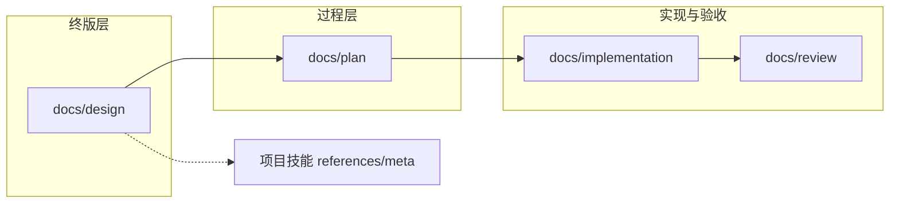

# 文档类型、目录与模板规则

> Agent 用：类型↔目录↔模板。新建**项目** `docs/` 资产前看 §2，从技能根 [templates/](../templates/) 复制。技能变更历史见根 [README.md](../README.md) §修订记录（本文无 YAML/修订表）。

## 1. 核心原则

| 原则 | 说明 |
|------|------|
| **一种类型 → 一个目录族** | 终版设计只进 `docs/design/`；重构/执行只进 `docs/plan/` |
| **终版不带日期** | `docs/design/` 禁止 `_YYYYMMDD` |
| **过程稿可带日期** | `docs/plan/`、`docs/review/` 允许 |
| **一种类型 → 一份模板** | 正文结构以本技能根 `templates/TEMPLATE_*` 为准 |
| **版本只进 YAML + §修订记录** | 禁止 `_FINAL`、`_V2`、`copy` 文件名 |

---

## 2. 文档类型总表

| 类型 ID | 中文名 | **唯一目录（项目内）** | 文件名模式 | `status` | 模板 |
|---------|--------|------------------------|------------|----------|------|
| `DESIGN` | 终版设计 | `docs/design/<domain>/` | `<TOPIC>_DESIGN.md` | `canonical` | [TEMPLATE_DESIGN_CANONICAL.md](../templates/TEMPLATE_DESIGN_CANONICAL.md) |
| `BRAINSTORM` | 头脑风暴/方案收敛 | `docs/plan/<domain>/` | `<TOPIC>_BRAINSTORM.md` | `in_progress`→`done`/`superseded`/`blocked` | [TEMPLATE_BRAINSTORM_CONVERGENCE.md](../templates/TEMPLATE_BRAINSTORM_CONVERGENCE.md) |
| `PLAN` | 执行计划 | `docs/plan/<domain>/` | `<TOPIC>_PLAN.md` | `in_progress`→`done` | [TEMPLATE_PLAN_EXECUTION.md](../templates/TEMPLATE_PLAN_EXECUTION.md) |
| `REFACTOR` | 重构计划 | `docs/plan/<domain>/` | `<TOPIC>_REFACTOR_PLAN.md` | `in_progress`→`done` | [TEMPLATE_REFACTOR_PLAN.md](../templates/TEMPLATE_REFACTOR_PLAN.md) |
| `IMPLEMENTATION` | 实现说明 | `docs/implementation/<lang>/<domain>/` | `<TOPIC>_IMPLEMENTATION.md` | `canonical` | [TEMPLATE_IMPLEMENTATION.md](../templates/TEMPLATE_IMPLEMENTATION.md) |
| `REVIEW` | 技术 Review | `docs/review/<domain>/` | `<TOPIC>_REVIEW_YYYYMMDD.md` | `in_progress`/`done` | [TEMPLATE_REVIEW.md](../templates/TEMPLATE_REVIEW.md) |
| `DOMAIN_INDEX` | 域索引 | `docs/design/<domain>/README.md` | `README.md` | `canonical` | [TEMPLATE_DOMAIN_README.md](../templates/TEMPLATE_DOMAIN_README.md) |
| `CONTRACT` | Agent 契约 | `.claude/skills/<skill>/references/meta/` | `<topic>_contract.md` | `canonical` | [TEMPLATE_CONTRACT.md](../templates/TEMPLATE_CONTRACT.md) |
| `CONFIG` | 配置说明 | `docs/config/` | `<TOPIC>_CONFIG.md` | `canonical` | [TEMPLATE_CONFIG.md](../templates/TEMPLATE_CONFIG.md) |
| `MIGRATION_SQL` | 开发迁移 | `docs/db/dev/<module>/` | `MIGRATION_<topic>_YYYYMMDD.sql` | — | [TEMPLATE_MIGRATION.sql](../templates/TEMPLATE_MIGRATION.sql) |

**禁止**：重构进 `design/`；终版带日期；无模板自建章节。

---

## 3. 各类型何时写、完成后

| 类型 | 何时创建 | 完成后 |
|------|----------|--------|
| `DESIGN` | 设计收敛门 | `canonical`；过程稿 `superseded` |
| `BRAINSTORM` | 头脑风暴 / 方案发散 / 反迎合检查 | 收敛为 Spec / ADR / Task Contract；完成后 `done` 或 `superseded` |
| `PLAN` / `REFACTOR` | 拆任务 / 结构性改动 | `done`；回写 DESIGN §实现状态 |
| `IMPLEMENTATION` | 代码结构稳定 | 链 DESIGN |
| `REVIEW` | 验证收口 | 列阻断/遗留 |
| `DOMAIN_INDEX` | 域内首份终版或合并后 | 同步 canonical 表 |
| `CONTRACT` | Agent 可执行契约 | 与 DESIGN 一致 |
| `MIGRATION_SQL` | 表/菜单/权限 | `related` 登记路径 |

---

## 4. 新建文档 SOP

1. 查 §2 定类型与目录  
2. 从技能根 `templates/` 复制模板到**项目**目标路径  
3. 按命名重命名  
4. 填 YAML + §修订记录（见 [document_revision_metadata.md](document_revision_metadata.md)）  
5. 更新项目 `docs/design/<domain>/README.md`  
6. 改前 `backup-file`  

---

## 5. 与技能内其他 reference 的关系

| 文件 | 职责 |
|------|------|
| 本文 + 根 [templates/](../templates/) | 类型、模板、终版/重构分目录 |
| [rd_lifecycle_doc_placement.md](rd_lifecycle_doc_placement.md) | 阶段门、关联 `related`、域 README |
| [design_doc_lifecycle.md](design_doc_lifecycle.md) | supersede、并入终版 |
| [document_revision_metadata.md](document_revision_metadata.md) | 修订表、版本语义 |

**项目内**仅保留：`docs/guide/DOCS_GOVERNANCE.md`（本仓库域索引、历史目录），**不得**再复制一套模板。
