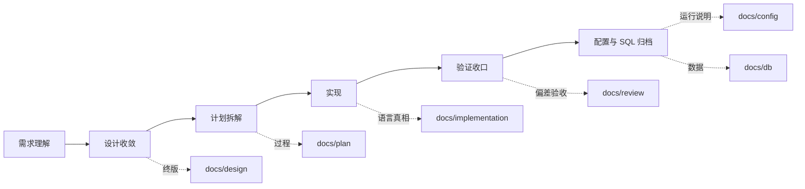

# 研发全流程文档放置与关联规范（通用）

> Agent 用：阶段门与 `docs/` 放置。项目域索引见各仓 `docs/guide/DOCS_GOVERNANCE.md`。技能变更历史见根 [README.md](../README.md) §修订记录。

## 1. 目标与单一真源

| 层级 | 真源文件 | 谁读 |
|------|----------|------|
| **跨项目（Agent）** | 本文 + [design_doc_lifecycle.md](design_doc_lifecycle.md) + [document_revision_metadata.md](document_revision_metadata.md) | `doc-script-governance` |
| **单仓库（人 + Agent）** | `<repo>/docs/guide/DOCS_GOVERNANCE.md`（或等价命名） | 该仓库所有研发 |
| **业务域入口** | `<repo>/docs/design/<domain>/README.md` | 该域设计与实现 |

**禁止**在多个顶层文件重复写完整目录表而不声明主次；旧文件只能 **supersede 跳转**，不能与新真源并列生效。

---

## 2. 与 delivery-workflow 阶段映射



| delivery-workflow 阶段 | 文档产出 | 放置目录 | 命名 | 完成后 |
|------------------------|----------|----------|------|--------|
| 1. 需求理解 | 可选调研纪要 | `docs/plan/<domain>/` 或 issue/纪要 | 可带日期 | 不当作长期真源 |
| 1. 需求理解 / 2. 设计收敛 | **头脑风暴 / 方案收敛过程稿** | `docs/plan/<domain>/` | `*_BRAINSTORM.md` | 收敛为 Spec / ADR / Task Contract；完成后 `done` / `superseded` / `blocked` |
| 2. 设计收敛 | **终版设计** | `docs/design/<domain>/` | `*_DESIGN.md`，**无** `_YYYYMMDD` | `status: canonical`；域 README 登记 |
| 2. 设计收敛 | **Agent 契约**（可选） | 项目技能 `references/meta/*_contract.md` | `*_contract.md` | 与终版 §契约 一致 |
| 2. 设计收敛 | 探索/对比稿 | `docs/plan/<domain>/` | 可带日期、`PLAN`/`DRAFT` | 并入终版后标 `done` 或 `superseded` |
| 3. 实现切分门 | **执行单 / 重构计划** | `docs/plan/<domain>/` | `*_PLAN.md`、`*_REFACTOR_PLAN.md` | 关闭时回写终版 §实现状态 |
| 4. 实现 | **实现说明** | `docs/implementation/<lang>/<domain>/` | `*_IMPLEMENTATION.md` | 指向 design 终版 |
| 5. 验证收口 | **Review / 验收** | `docs/review/<domain>/` | `*_REVIEW_YYYYMMDD.md` 允许 | 列阻断/遗留/回执 |
| 5. 验证收口 | **配置说明** | `docs/config/` | 按子目录 | 与 design 配置章节互链 |
| 全程 | **开发 SQL** | `docs/db/dev/<module>/` | `MIGRATION_*_YYYYMMDD.sql` | 每模块 `mysql57_dev_final.sql` |
| 发版后 | **上线基线 SQL** | `docs/db/online/<module>/` | 只读，人工整理 | Agent **禁止**写入 |

---

## 3. 顶层目录职责（硬边界）

| 目录 | 只放什么 | 不放什么 |
|------|----------|----------|
| `docs/design/<domain>/` | 业务目标、流程、规则、状态机、语言无关 Mermaid、终版架构 | Java 类名、Vue 整改项、本轮 diff、SQL 风险结论 |
| `docs/implementation/<lang>/<domain>/` | 模块映射、分层、接口/表/消息、与 design 差异 | 业务流程首写（应先在 design） |
| `docs/review/<domain>/` | 偏差、阻断项、验收、回归 | 新业务方案正文 |
| `docs/plan/<domain>/` | 里程碑、任务拆解、友商单、重构执行单 | 长期 canonical 设计（应升格到 design） |
| `docs/config/` | 开关、环境、Nginx、脱敏示例 | 业务规则真源 |
| `docs/guide/` | **本仓库**文档治理、接入标准 | 业务域设计正文 |
| `docs/db/dev/` | 开发态 DDL/DML/迁移 | 上线基线 |
| `docs/db/online/` | 上线基线（只读） | 日常开发编辑 |

**禁止**：新增 review 进 `docs/design/review/`；仓库级文档进 `src/main/resources/` 或业务模块源码树（注释除外）。

---

## 4. 关联文档规则（强制）

每份 **canonical** 设计/实现文档，文首或 §相关文档 必须能回答：**我还该读哪几份？**

### 4.1 推荐 YAML（文首扩展）

```yaml
related:
  - path: docs/plan/ai/TRACE_TREE_ASSEMBLER_REFACTOR_PLAN.md
    role: plan_for          # plan_for | implements | reviews | contract | supersedes
  - path: $AGENTS_HUB_ROOT/skills/projects/<project-key>/<project-skill>/references/meta/trace_phase_contract.md
    role: contract
canonical_entry: docs/design/ai/README.md
```

| `role` | 含义 |
|--------|------|
| `canonical` | 本域主入口（通常 README） |
| `plan_for` | 本设计的执行/重构计划 |
| `implements` | 实现层文档 |
| `reviews` | review/验收 |
| `contract` | Agent 可执行契约（技能 references） |
| `supersedes` | 取代的旧稿路径（旧稿改 `status: superseded` 并链回新稿） |

### 4.2 域索引 README（每域必备）

路径：`docs/design/<domain>/README.md`

至少包含：

1. **Canonical 表**：终版设计文件名 + 一句话职责  
2. **过程稿**：仍在 plan 或待合并的带日期稿  
3. **关联**：implementation / review / plan / 技能契约 的路径  
4. **禁止**：不要把 README 写成第二份完整设计正文  

### 4.3 正文互链约定

- 用**仓库内相对路径**：`docs/design/ai/AI_RUNTIME_OBSERVABILITY_DESIGN.md`
- 过程稿合并后：旧稿顶部 `> **Superseded**：…` + `status: superseded`
- **禁止**正文链接 `bak/`（修订表审计列除外）

---

## 5. 命名规范

| 类型 | 模式 | 日期后缀 |
|------|------|----------|
| 终版设计 | `<TOPIC>_DESIGN.md` | **禁止** |
| 头脑风暴/方案收敛 | `<TOPIC>_BRAINSTORM.md` | 允许但不推荐 |
| 过程/计划 | `<TOPIC>_PLAN.md`、`*_REFACTOR_PLAN.md`、友商 `*_TASK_*.md` | 允许 |
| Review | `<TOPIC>_REVIEW_YYYYMMDD.md` | 允许 |
| 迁移 SQL | `MIGRATION_<topic>_YYYYMMDD.sql` | 允许 |
| 契约 | `*_contract.md`（技能 references/meta） | 禁止 |

**禁止**用 `_FINAL`、`V2`、`copy` 管理版本；版本只进 YAML + §修订记录。

---

## 6. 技能与 Prompt 放置（与 docs 并列）

| 资产 | 路径 |
|------|------|
| 项目技能真源 | hub `skills/projects/<project-key>/<skill>/`（工作区 `.claude/skills/` / `.cursor/skills/` 仅为挂载镜像） |
| 可执行契约 | `<skill>/references/meta/*_contract.md` |
| 共享技能 | hub `skills/share/` |
| Prompt | hub `prompts/projects/` 或 `prompts/share/` |

契约与 `docs/design` 终版冲突时，**以终版为准**，改契约并记修订表。

---

## 7. 默认产出顺序（非平凡需求）

1. `docs/design/<domain>/` — 冻结业务/架构终版  
2. `docs/plan/<domain>/` — 计划与执行单（可并行起草，不得替代终版）  
3. 代码 + `docs/db/dev/`  
4. `docs/implementation/` — 实现结构沉淀  
5. `docs/review/` — 偏差与验收  
6. `docs/config/` — 运行与开关说明  
7. 域 README 与 `docs/README.md` 索引同步更新  

---

## 8. Agent 改文档最小检查清单

- [ ] 放置目录符合上表  
- [ ] 改前 `backup-file`  
- [ ] 改后 `updated` / `version` / §修订记录  
- [ ] canonical 文档已填 `related` 或 §相关文档  
- [ ] 过程稿已 `superseded` 或迁 plan，且域 README 已更新  
- [ ] 未写入 `docs/db/online/`  

---

## 9. 项目落地

在目标仓库创建或维护：

| 文件 | 内容 |
|------|------|
| `doc-script-governance/references/document_types_and_templates.md` | **类型 ↔ 目录 ↔ 命名 ↔ 模板**（技能真源） |
| `doc-script-governance/templates/TEMPLATE_*.md` | 空白模板（技能根，非 references 下） |
| `<repo>/docs/guide/DOCS_GOVERNANCE.md` | **仅**本仓库域索引、历史目录（可选） |

`docs/README.md` 只保留业务 docs 入口；**禁止**在 `docs/guide/` 复制模板或类型总表。

### 9.1 类型与目录（速记）

| 类型 | 目录 |
|------|------|
| 终版设计 `DESIGN` | `docs/design/<domain>/` |
| 执行 `PLAN`、重构 `REFACTOR` | `docs/plan/<domain>/`（同目录族，不同模板） |
| 实现 `IMPLEMENTATION` | `docs/implementation/<lang>/<domain>/` |
| Review `REVIEW` | `docs/review/<domain>/` |
