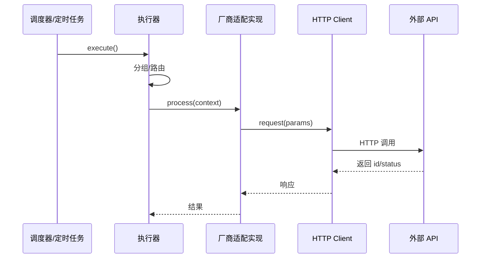
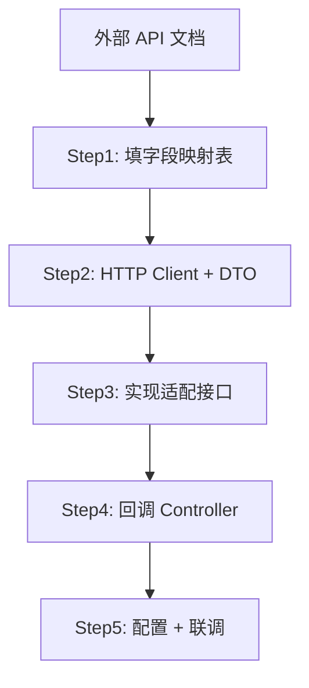

# 技能图表规范（外部对接类技能必读）

适用于任意**外部系统/厂商对接**类技能（如第三方 API、消息推送、支付、通知等）。仅靠接口文档难以让 AI 理解完整交互与数据流转，必须补充 Mermaid 图。与具体业务无关，可复制到任意项目使用。

---

## 一、何时必须补充图表

| 技能类型 | 必须图表 | 说明 |
|----------|----------|------|
| 外部系统/厂商对接 | 交互时序图 + 数据流转图 | 接口文档只描述请求/响应，无法体现「谁调谁」「数据从哪来到哪去」 |
| 多步骤工作流 | 流程图 + 状态机 | 帮助 AI 理解分支、重试、回调顺序 |
| 模块间协作 | 时序图 | 明确调用链、回调链、路由逻辑 |

---

## 二、推荐图表类型

### 2.1 交互时序图（sequenceDiagram）

**用途**：展示「谁在何时调用谁」，适合主动调用链、回调链。

**要点**：
- 图里优先使用“角色名 + 关键实现名”的写法；既能看懂职责，也能支持快速定位
- 不要求每个节点都写满具体类名，但入口、核心处理、回调入口、关键表/字段应尽量标明真实对象
- 标注关键数据（id、status、流水号等）的传递
- 回调链单独画一张，标注「外部系统 → Controller → Service」

### 2.2 数据流转图（flowchart）

**用途**：展示数据从哪来、经过哪些表/服务、最终落到哪。

**要点**：
- 左到右或上到下表示时间顺序
- 可以用「任务表」「结果表」「状态字段」等通用表述起草，但最终技能应尽量替换成真实表名、字段名或关键节点
- 回调更新了哪些表、哪些字段要写清

### 2.3 对接流程图（flowchart）

**用途**：从「拿到 API 文档」到「完成对接」的步骤。

---

## 三、图表放置位置

| 位置 | 内容 |
|------|------|
| SKILL.md 主文件 | **默认不放**完整 Mermaid：仅 **一行**主链路摘要 + `references/xxx.md` **指针**；与「主文件 = 路由器」一致。仅当单张图 **≤15 行**且能独立表达主链路、不挤占路由表时，可例外嵌入 |
| `references/*.md` | **默认**放置主流程时序图、回调链、数据流、状态机、对接步骤图及长图变体 |

主文件若嵌图，须同步控制**非空行**不超过该 skill 类型上限；对接类长图 **一律**优先 `references/`。

## 四、检查清单（外部对接类技能）

- [ ] 有**主动调用链**时序图（我方 → 外部系统）
- [ ] 有**回调链**时序图（外部系统 → 我方）
- [ ] 有**数据流转图**（关键表、关键字段）
- [ ] 字段映射表与图中节点一致
- [ ] 图中参与者命名与技能正文术语统一
- [ ] 图既能看懂职责，也能定位到关键实现、关键表或关键字段

---

## 五、反模式

| 反模式 | 问题 | 正确做法 |
|--------|------|----------|
| 只有接口文档 | AI 不知道调用顺序、回调时机 | 补充时序图 + 数据流转图 |
| 图过于抽象 | 没有表名、字段名、类名 | 图中标注关键实体 |
| 图与正文脱节 | 图中用 A/B/C，正文用 Executor | 术语统一，可读性优先 |
| 图只有职责没有定位 | 只写“执行器”“处理器”，无法落到具体入口 | 关键节点补真实类名、方法名、表名或字段名 |
